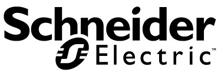

Schneider Electric has a long-standing commitment to openness, exemplified by its early adoption of open communication buses and open technology strategy. This commitment is further solidified by its **Open Source Program Office** (OSPO), which actively promotes collaboration and contributes to projects benefiting multiple business sectors. 

Schneider Electric recognizes the importance of open source in software reuse and resource management within the evolving digital landscape while maintaining product reliability, security, and safety.

We believe in the power of open source to drive innovation and collaboration. Join us on our journey!

_The Schneider Electric OSPO team_

- [Principles and Values](PRINCIPLES.md)
- [Modus Operandi](OPERATIONS.md)

### Get Involved

- Visit the dedicated Schneider Electric Open Source web page to read [our manifesto](https://www.se.com/ww/en/about-us/open-source/manifesto.jsp).
- Contribute to [our projects](https://github.com/orgs/schneider-electric/repositories).

#### Contributions

- [OPC-UA Device Service](https://github.com/SE-I-T-Digital/device-opcua-go): An EdgeX Foundry Device Service, written in Go, which uses OPC UA to interact with devices and IoT objects.
- _More to come!_
